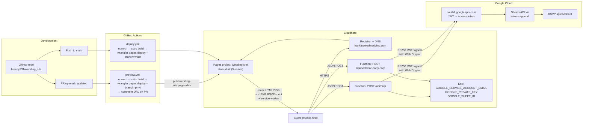
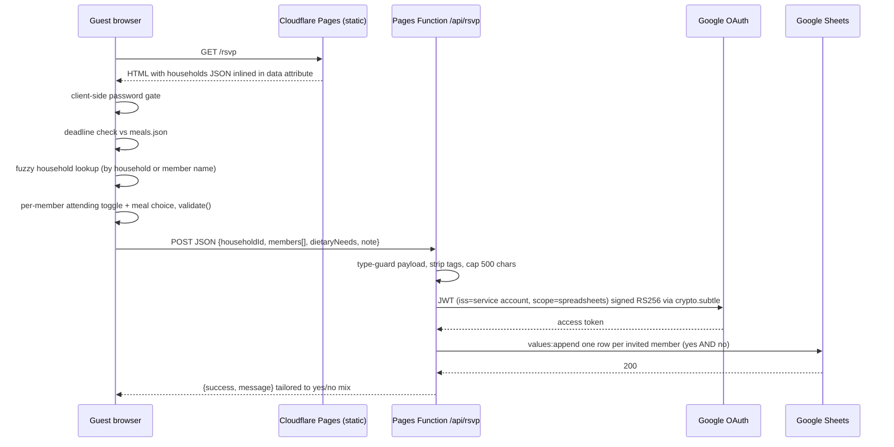

# Hankins-Reed Wedding Website — Architecture

Portfolio writeup for the wedding site that ran at `hankinsreedwedding.com` from
February 2026 through September 2026. Decommissioned after the wedding
(August 22, 2026). Live shots are in `screenshots/`.

## At a glance

| | |
|---|---|
| Purpose | Info hub + RSVP collection for ~175 guests |
| Framework | Astro 5 (static output, zero client JS by default) |
| Styling | Tailwind CSS 4 with custom design tokens (`@theme`) |
| Hosting | Cloudflare Pages (free tier) + Cloudflare Registrar for the domain |
| Backend | Two Cloudflare Pages Functions (Workers runtime) writing to a Google Sheet |
| CI/CD | GitHub Actions: preview deploy per PR, production deploy on `main` |
| Offline | Hand-written service worker precaching pages + self-hosted fonts |
| Tests | Vitest unit tests on the pure RSVP state/validation helpers |
| Timeline | 31 commits, 22 PRs, Jan 17 – Jul 6, 2026 |

## System diagram



## RSVP data flow



## Design decisions worth talking about

**Static-first, islands nowhere.** Every page is prerendered HTML. The only
client script that ships is the RSVP form (about 12 KB) plus a 4 KB service
worker. No framework runtime. This is what let the site hit the performance
budget (< 50 KB JS, LCP target < 2.5 s on 3G) with no tuning.

**Pages Functions instead of a server.** The RSVP write path needed a secret
(a Google service-account key) so it could not be client-side. Cloudflare
Pages Functions run on the Workers runtime next to the static assets, so the
whole thing stays one deploy, one project, zero servers, zero cost.

**Google Sheets as the database.** The "admin UI" for a wedding is a
spreadsheet the couple and planner already share. The function signs a JWT
with the Web Crypto API (no `googleapis` SDK, which does not run on Workers)
and calls the REST API directly. One row per invited person, including
declines, so the sheet has no silent gaps.

**Household model, not guest model.** Invitations go to households
(`Mr. and Mrs. X`, `Jane + guest`). The lookup matches on household name
or any member name, dedupes by household, and the form renders one
attending/meal row per member. The pure helpers for this (`src/lib/rsvp.ts`)
are unit-tested in isolation from the DOM.

**Content as data.** Venues, hotels, FAQ, meals, schedule, and the guest
list are JSON under `src/data/`. Copy changes were PRs that touched one
JSON file, which made them safe to delegate to an AI agent with a
build/typecheck/lint gate (see `AGENTS.md` and `prompts/`).

**Preview deploys per PR.** The preview workflow deploys to a
`pr-N` branch alias on Pages and upserts a comment with the URL, so
non-technical review (the partner, the planner) was a link click.

**Offline and self-hosted.** Fonts are self-hosted `.woff2`, and the service
worker precaches the Details/FAQ/Travel pages so the day-of info survives a
bad venue signal.

**Privacy posture.** No analytics, no third-party scripts, no Google Maps
API (links out instead). The tradeoff that would be done differently next
time: the guest list is inlined in the HTML behind a client-side password
gate, so it was only obscured, not protected. A Function-backed lookup would
have kept names off the wire.

## Repo layout

```
src/pages/        9 Astro routes (home, details, travel, chicago, faq, registry, rsvp, bachelor-party, 404)
src/components/   Hero, Navigation, Footer, Timeline, Accordion, VenueCard, HotelCard, Countdown, VenueFeature
src/data/         wedding, venues, hotels, faq, meals, chicago, guests (JSON)
src/lib/rsvp.ts   pure RSVP state, validation, lookup, payload→rows (+ vitest)
functions/api/    rsvp.ts, bachelor-party-rsvp.ts (Pages Functions)
functions/lib/    google-sheets.ts (JWT auth + append)
public/           sw.js, offline.html, manifest.json, fonts, images, videos
.github/workflows deploy.yml (main), preview.yml (PRs)
```
